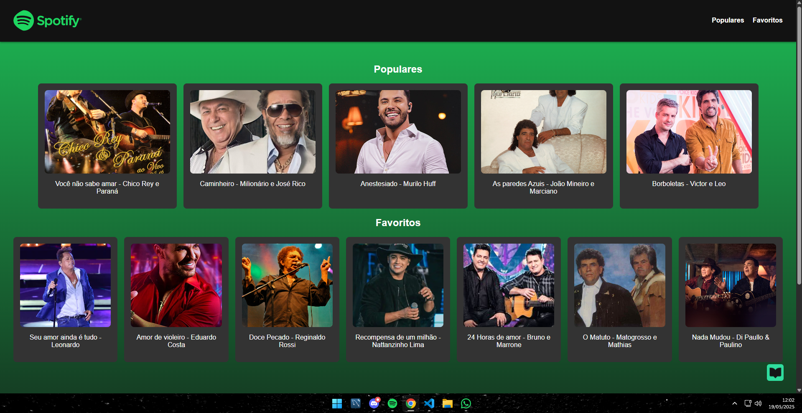

# Site Spotify - Populares e Favoritos

Este é um site simples inspirado no Spotify, com duas telas principais:

- **Populares:** Mostra 5 músicas de artistas em alta.
- **Favoritos:** Mostra 7 músicas favoritas.

---

## Visual do Site

---

## Tecnologias usadas

- HTML semântico
- CSS com Flexbox
- Animações simples

---

## Como executar

1. Clone ou baixe este repositório.
2. Abra o arquivo `index.html` no seu navegador favorito.
3. Aproveite o site!

---

## Personalização

- Para trocar as imagens dos artistas, substitua as URLs nas tags `` do arquivo HTML.
- Para mudar as cores, edite o arquivo CSS embutido.

---

## Autor

Guilherme Neto Info D - 2025

---

Se quiser, posso ajudar a melhorar ou adicionar funcionalidades. É só pedir! 🎵
